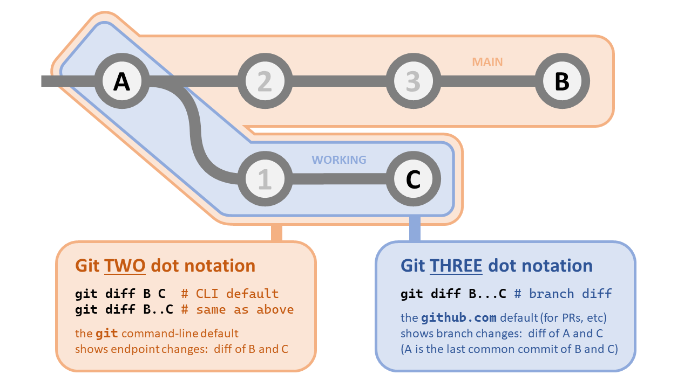

# Git diff 2-dot vs 3-dot

### Did you know `git diff` has two different modes?

Since I've encountered confusion over this a few times, here's a quick overview
of the differences between the `git diff` "2-dot" vs "3-dot" notation.

* **2-dot** == `git diff B..C` == `git diff B C`
  * This mode shows the changes between commit `B` and `C` and is the
    functionality you generally expect, similar to how the GNU `diff` tool will
    present changes between files and directories.
  * This mode is also the Git CLI "default" mode (note the `..` vs the space).
* **3-dot** == `git diff B...C`
  * Because `git` tracks history, this mode shows the changes only on the
    current branch--typically since it's creation, but specifically the changes
    made to `C` against `B and C`'s common ancestor, _i.e._ `A`.
  * By default, [GitHub pull requests show a three-dot diff].  If you've ever
    wondered why your local `git diff` output doesn't match the changes
    presented in your pull request, this difference in modes is why.

### Why does this matter?

If you've created a branch, you usually only care about the changes you've made
on that particular branch.  For short lived branches, the 3-dot diff will show
what you're interested in.  

However, if you use a branching model like [git flow] or [Github flow], you'll
often have long-lived branches.  You'll eventually find yourself merging changes
from other branches (e.g. main) to keep up-to-date.  Once you do, your working
branch (and `git diff`) can become cluttered with changes you didn't make.  This
is where the default 2-dot mode helps, since it excludes changes common to both.

[git flow]: https://nvie.com/posts/a-successful-git-branching-model/
[Github flow]: https://docs.github.com/en/get-started/quickstart/github-flow
[GitHub pull requests show a three-dot diff]: https://docs.github.com/en/pull-requests/collaborating-with-pull-requests/proposing-changes-to-your-work-with-pull-requests/about-comparing-branches-in-pull-requests
